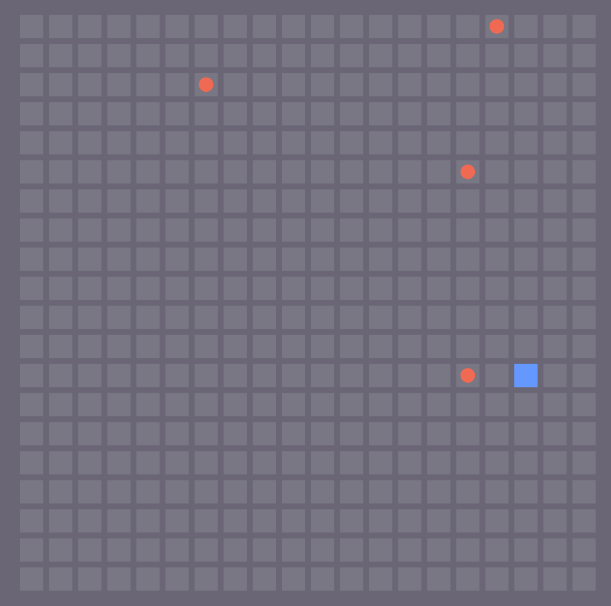

The 2017 Game Server

* [API documentation](https://stembolthq.github.io/battle_snake/)
* [Event Information](https://github.com/sendwithus/battlesnake)
* [BattleSnake.io](https://www.battlesnake.io/)
* [Stembolt](https://stembolt.com/)
* [Tutorial Slides](https://docs.google.com/presentation/d/1iD2xZthNFaWeNfgPr6KjR8e7O80Pua9mdQje3i8782A/edit#slide=id.g1190002876_0_196)

[](https://travis-ci.org/StemboltHQ/battle_snake) [](https://coveralls.io/github/StemboltHQ/battle_snake?branch=master) [](https://hub.docker.com/r/stembolt/battle_snake/)



## Running With Docker

* Install [Docker](https://docs.docker.com/engine/installation/)
* `docker run -it -p 4000:4000 stembolt/battle_snake`
* Connect to http://localhost:4000

**Note:** Docker runs on a virtual lan so when you add a snake to the game you cannot use `localhost`, use your internal IP instead.

## Building from source

### Prerequisites

* [Erlang/OTP19](https://www.erlang.org/downloads)
* [Elixir v1.4](http://elixir-lang.org/install.html)
* [NPM](http://blog.npmjs.org/post/85484771375/how-to-install-npm)
* [Sass](http://sass-lang.com/install)

```sh
git clone git@github.com:StemboltHQ/battle_snake.git`
cd battle_snake
./scripts/setup
./scripts/dev-server
```

## Testing

```sh
mix test
```

## Building the docker image locally

* `docker build --rm -t battle_snake_server .`
* `docker run -it -p 4000:4000 battle_snake_server`
* Connect to http://localhost:4000
