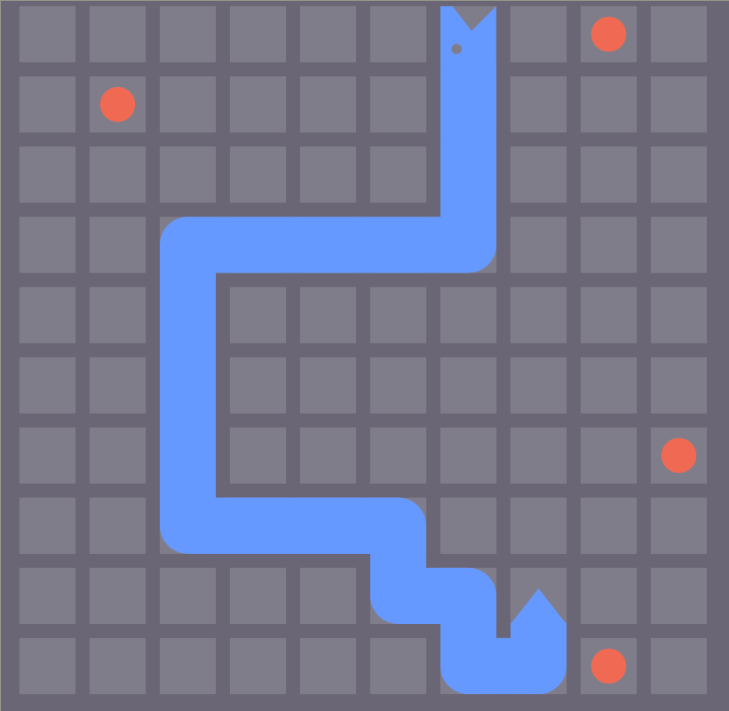
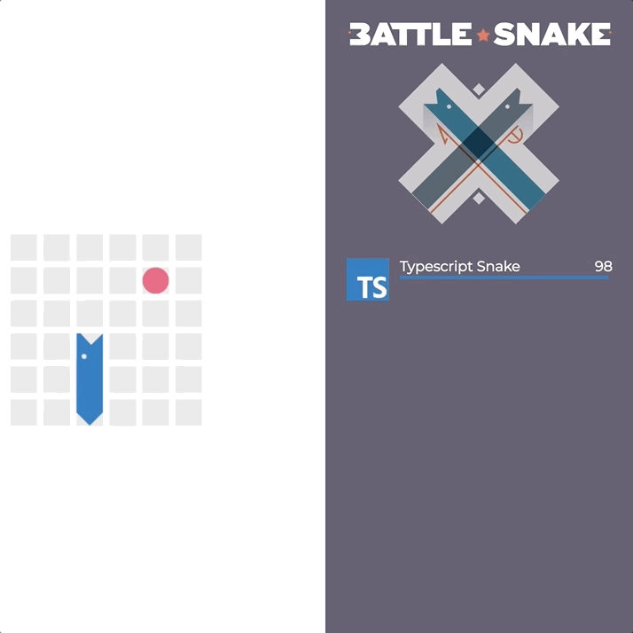
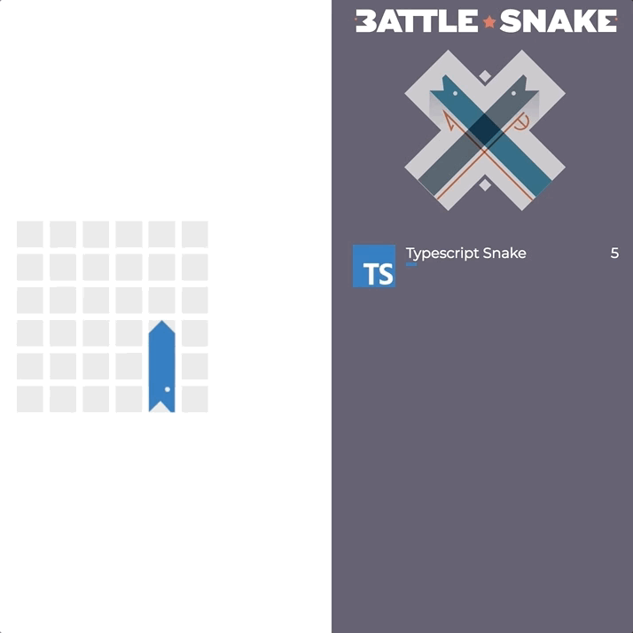
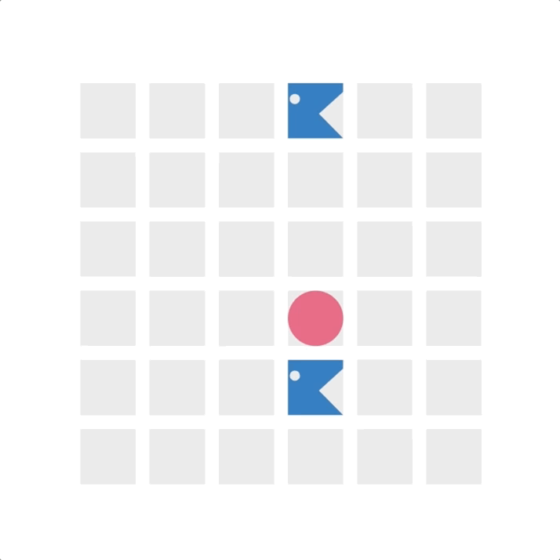

[](https://circleci.com/gh/battle-snake/battle_snake)

[](https://www.battlesnake.io/)
The 2018 Official Game Server

* [Event Information](https://www.battlesnake.io/)




BattleSnake is an adaptation of the classic video game "Snake", where the player
maneuvers a snake around the game board to collect food pellets, which makes the
snake grow longer. The main objective is to collect as much food as as possible
while avoiding obstacles like walls and snakes' body.

In BattleSnake a number of snakes are pitted against each other and the last
snake alive wins.

<!-- markdown-toc start - Don't edit this section. Run M-x markdown-toc-refresh-toc -->
**Table of Contents**

- [Competitors' Guide](#competitors-guide)
    - [Game Rules](#game-rules)
        - [Avoid Walls](#avoid-walls)
        - [Eat Food](#eat-food)
        - [Don't Starve](#dont-starve)
        - [Don't Collide with Snakes' Tails](#dont-collide-with-snakes-tails)
        - [Head on Collisions](#head-on-collisions)
    - [Testing Your Snake](#testing-your-snake)
    - [API Webhooks](#api-webhooks)
        - [POST /start](#post-start)
            - [The StartRequest Object](#the-startrequest-object)
            - [The StartResponse Object](#the-startresponse-object)
            - [Example Request](#example-request)
            - [Example Response](#example-response)
        - [POST /move](#post-move)
            - [The MoveResponse Object](#the-moveresponse-object)
            - [The Move type](#the-move-type)
            - [The World object](#the-world-object)
            - [The Snake object](#the-snake-object)
            - [The List object](#the-list-object)
            - [The Point object](#the-point-object)
            - [Example Request](#example-request-1)
            - [Example Response](#example-response-1)
- [Development](#development)
    - [Running with Docker](#running-with-docker)
    - [Networking issues](#networking-issues)
    - [Compiling From Source](#compiling-from-source)
        - [Dependencies](#dependencies)
    - [Testing](#testing)
        - [End to End Tests](#end-to-end-tests)
        - [Unit Tests](#unit-tests)

<!-- markdown-toc end -->

# Competitors' Guide
## Game Rules
### Avoid Walls

If a snake leaves the last tile of the board, they will die.


### Eat Food

Eating a food pellet will make snakes one segment longer. Snakes grow out of
their tail: new tail segment will appear in the same square that the tail was in
the previous turn.

Eating a food pellet will restore snakes' health-points to 100.

The amount of food can vary from game to game, but within the same game it will
always stay the same. As soon as a piece of food is eaten, it will respawn at a
random, unoccupied location on the next turn.




### Don't Starve

Every turn snakes will loose one health-point. In BattleSnake health-points
serve like the snake's hunger bar, and if it reaches zero, the snake will starve
and die. Eating food will restore snake's health to one-hundred points on the
next turn.



### Don't Collide with Snakes' Tails

If a snake collides with itself or any other snakes' tails, it dies.


### Head on Collisions

Head-to-head collisions follow different rules than the previously mentioned
tail collisions.

In head-on collisions, the longer snake will survive.



But if both snakes are the same size, they both die. Note that in the below
scenario, the food remains (collisions are resolved before food is eaten).


## Testing Your Snake

If you have a game server running locally you can visit `/test`, plug your
snake's URL in and a number of tests will be run against your server, checking
if it follows all the basic game rules.

## API Webhooks

All interactions with the game are implemented as HTTP POST webhooks. Once the
game has begun your server will receive a request to your `/start` endpoint, and
then on each turn a request to the `/move` endpoint.

### POST /start

| URL                    | /start                                             |
| Method                 | POST                                               |
| request body JSON      |  object   |
| expected response JSON |  object |

#### The StartRequest Object

```typescript
interface StartRequest {
  game_id: string;
}
```

#### The StartResponse Object

```typescript
interface StartResponse {
  color: string;
  name: string;
  head_url: string;
  taunt: string;
  head_type: string;
  tail_type: string;
  secondary_color: string;
}
```

#### Example Request

```json
{
  "game_id": "b1dadee8-a112-4e0e-afa2-2845cd1f21aa"
}
```

#### Example Response

```json
{
    "color": "#FF0000",
    "secondary_color": "#00FF00",
    "head_url": "http://placecage.com/c/100/100",
    "name": "Cage Snake",
    "taunt": "OH GOD NOT THE BEES",
    "head_type": "pixel",
    "tail_type": "pixel"
}
```


### POST /move

A request including all the current game information will be issued to this
endpoint on each turn. The game server expects a JSON response within 200ms.

| URL                    | /move                                        |
| Method                 | POST                                         |
| request body JSON      |  object           |
| expected response JSON |  object |

#### The MoveResponse Object

```typescript
interface MoveResponse {
  move: Move;
}
```

#### The Move type

```typescript
type Move = 'up' | 'down' | 'left' | 'right';
```

#### The World object

```typescript
interface World {
  object: 'world';
  id: number;
  you: Snake;
  snakes: List<Snake>;
  height: number;
  width: number;
  turn: number;
  food: List<Point>;
}
```

#### The Snake object

```typescript
interface Snake {
  body: List<Point>;
  health: number;
  id: string;
  length: number;
  name: string;
  object: 'snake';
  taunt: string;
}
```

#### The List object

```typescript
interface List<T> {
  object: 'list';
  data: T[];
}
```

#### The Point object

```typescript
interface Point {
  object: 'point';
  x: number;
  y: number;
}
```

#### Example Request

```json
{
  "food": {
    "data": [
      {
        "object": "point",
        "x": 0,
        "y": 9
      }
    ],
    "object": "list"
  },
  "height": 20,
  "id": 1,
  "object": "world",
  "snakes": {
    "data": [
      {
        "body": {
          "data": [
            {
              "object": "point",
              "x": 13,
              "y": 19
            },
            {
              "object": "point",
              "x": 13,
              "y": 19
            },
            {
              "object": "point",
              "x": 13,
              "y": 19
            }
          ],
          "object": "list"
        },
        "health": 100,
        "id": "58a0142f-4cd7-4d35-9b17-815ec8ff8e70",
        "length": 3,
        "name": "Sonic Snake",
        "object": "snake",
        "taunt": "Gotta go fast"
      },
      {
        "body": {
          "data": [
            {
              "object": "point",
              "x": 8,
              "y": 15
            },
            {
              "object": "point",
              "x": 8,
              "y": 15
            },
            {
              "object": "point",
              "x": 8,
              "y": 15
            }
          ],
          "object": "list"
        },
        "health": 100,
        "id": "48ca23a2-dde8-4d0f-b03a-61cc9780427e",
        "length": 3,
        "name": "Typescript Snake",
        "object": "snake",
        "taunt": ""
      }
    ],
    "object": "list"
  },
  "turn": 0,
  "width": 20,
  "you": {
    "body": {
      "data": [
        {
          "object": "point",
          "x": 8,
          "y": 15
        },
        {
          "object": "point",
          "x": 8,
          "y": 15
        },
        {
          "object": "point",
          "x": 8,
          "y": 15
        }
      ],
      "object": "list"
    },
    "health": 100,
    "id": "48ca23a2-dde8-4d0f-b03a-61cc9780427e",
    "length": 3,
    "name": "Typescript Snake",
    "object": "snake",
    "taunt": ""
  }
}
```

#### Example Response

```json
{
  "move": "up"
}
```

# Development

## Running with Docker

You can run the official BattleSnake game server through Docker, allowing you to develop your snakes locally and whenever you want.


```
docker run -it -p 3000:3000 battle-snake/battle_snake
```

You should be able to view the game server at http://localhost:3000. 


## Networking issues

If you are running your snake on localhost, you won't be able to reference it as
`localhost` because the container runs on its own network. If you're running
Docker For Mac you can reference localhost:5678 with
http://docker.for.mac.localhost:5678/, otherwise use your full ip address on
your network to reference your localhost (192.168.1.xxx or whatever your subnet
is configured for, use ifconfig to find out).

## Compiling From Source

### Dependencies
* [Erlang](https://www.erlang.org/downloads)
* [Elixir](http://elixir-lang.org/install.html)
* [NPM](http://blog.npmjs.org/post/85484771375/how-to-install-npm)
* [Yarn](https://yarnpkg.com/lang/en/docs/install)

**MacOSX**

```sh
brew update && brew install erlang elixir nodejs yarn
```

**Linux**

I suggest installing Erlang through [evm](https://github.com/robisonsantos/evm)
and Elixir through [kiex](https://github.com/taylor/kiex).

```sh
git clone git@github.com:battle-snake/battle_snake.git`
cd battle_snake
yarn install
mix do local.hex --force, local.rebar
mix do deps.get, deps.compile
mix do ecto.create, ecto.migrate
mix phx.server
```

## Testing
### End to End Tests
```sh
yarn cypress:open
```
### Unit Tests
```sh
mix test
```

Spotted an inaccuracy in the document, think they suck, or have a suggestion on how to make it better? Open an [issue](https://github.com/battle-snake/battle_snake/issues), or even better submit a [PR](https://github.com/battle-snake/battle_snake/pulls)!
